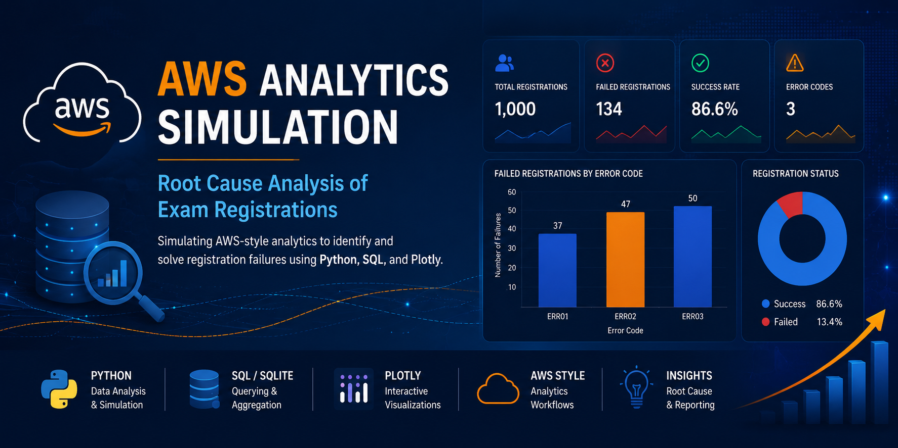

  

This project simulates the use of AWS-style analytics to perform root cause analysis on student exam registration failures—similar to tasks handled by the College Board's Exam Config team. It demonstrates how to use Python, SQL-style querying, and static visualization techniques to generate insights from operational data.

---

## Business Problem

Educational testing organizations need efficient ways to identify the causes of failed exam registrations and operational bottlenecks.This project simulates an AWS-style analytics workflow to identify registration failure trends using SQL-style analysis and visualization techniques.

---

##  Project Overview

- Generate a synthetic dataset of 1,000 exam registrations
- Simulate AWS querying (Athena/Redshift) using SQLite
- Perform root cause analysis on failed registrations
- Visualize insights with a static Plotly bar chart (nbviewer-compatible)
- Export data for simulated S3 integration

---

##  Key Skills Demonstrated

- Python Analytics
- SQL & SQLite Querying
- Root Cause Analysis
- Plotly Visualization
- AWS-style Analytics Simulation
- Business Intelligence Reporting
- Data Simulation & Aggregation
---

##  Tools Used

- Python (Pandas, NumPy)
- SQLite3 (for SQL-style analytics)
- Plotly (static visualization via Kaleido)
- Google Colab (development environment)
- GitHub + nbviewer (rendered notebook sharing)

---

##  View the Rendered Notebook

👉 ** [View in nbviewer](https://nbviewer.org/github/asaiewane/aws-root-cause-analytics/blob/main/aws_exam_analytics_simulation.ipynb)**

This version includes:
- Full SQL analysis workflow
- Static Plotly visualization of error codes
- Output-safe format for sharing with reviewers

---

## Author

**Alphonso J. Saiewane**  
*Data Scientist | AI Prompt Engineer | International Trade Expert*  
📧 alphonso.saiewane@gmail.com  
🔗 [LinkedIn](https://www.linkedin.com/in/alphonso-jeromas-saiewane-811b2b24b)

---

© 2025 Alphonso J. Saiewane. All rights reserved.
